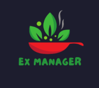

<h1 align="center">
  Ex Manager
</h1>

  <a href="#-funcionalidades">Funcionalidades</a>&nbsp;&nbsp;&nbsp;|&nbsp;&nbsp;&nbsp;
  <a href="#-tecnologias">Tecnologias</a>&nbsp;&nbsp;&nbsp;|&nbsp;&nbsp;&nbsp;
  <a href="#-layout">Layout</a>&nbsp;&nbsp;&nbsp;|&nbsp;&nbsp;&nbsp;
  <a href="#-contatos">Contatos</a>

    

  Projeto desenvolvido e atrelado com a disciplina de "Projeto Prático de Construção de Sistemas Computacionais" da UNINOVE onde o Professor Orientador é o Thiago G. Trau. O mesmo tem por seu objetivo ser um local onde os clientes desta rede de Estacionamentos possam realizar suas reservas e garantir a segurança do seu veículo. 

 

<!-- LINGUAGENS -->
## 🚀 Tecnologias
Esse projeto foi desenvolvido com as seguintes tecnologias:

- `Front-End` 

    
   

 - `Back-End` 
          
   
   
        
 - `Mobile` .png
 
   
   
           
- `Ferramentas` 

   
   
              
- `Versionamento` 
                  

<!-- LAYOUT DO SISTEMA -->
## 💻 Layout
Você pode visualizar o layout básico do projeto através [desse link](https://www.figma.com/file/HhqD02XrBa095S21muQ6Ho/Ex-Manager?node-id=0-1&t=eOTbDJZgXxGV6DFl-0). Lembrando que não é necessário ter uma conta no Figma para acessá-lo.

<!-- CONTATO -->
## ✉️ Contato
&nbsp;

---

Copyright ©️ 2021 - Ex Manager
